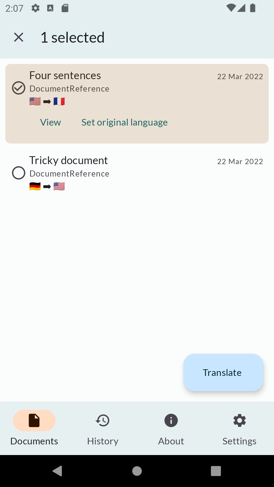
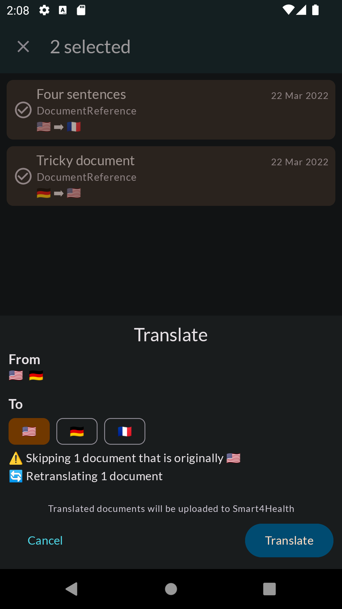

# eTranslation App

---

## Acknowledgements


This project has received funding from the European Union’s Horizon 2020 research and innovation programme under grant agreement No 826117.

---

Android app to translate documents, interfaces with the [eTranslation Service].

[eTranslation Service]: https://github.com/smart4health/etranslation-service

<div align="center"></div>


## Building

The D4L SDK is distributed as a package on Github, as such, you will need a
[Personal Access Token] with the `read:packages` scope.  Store this token in
the `gpr.token` key in [secrets.properties](secrets.properties), along with
your username under the `gpr.user` key

[eTranslation Service](https://github.com/smart4health/etranslation-service) basic auth credentials
also belong here under the keys `es.user` and `es.password`. 

Together, your [secrets.properties](secrets.properties) file should look something like

```properties
gpr.user=...
gpr.token=ghp_PERSONAL_ACCESS_TOKEN
es.user=client_app
es.password=HEX_STRING
```

with the correct values filled in.  This file is already ignored by [.gitignore](.gitignore)
to prevent accidental uploads.

[Personal Access Token]: https://github.com/settings/tokens/new

D4L SDK configuration is done in separate properties files: [debug.chdp.properties](debug.chdp.properties)
and [release.chdp.properties](release.chdp.properties) respectively. These contain the same key-value
pairs as required by the SDK and are in fact directly added as manifest placeholders:

```properties
clientId=...
clientSecret=...
environment=...
redirectScheme=...
debug=false
platform=s4h
```